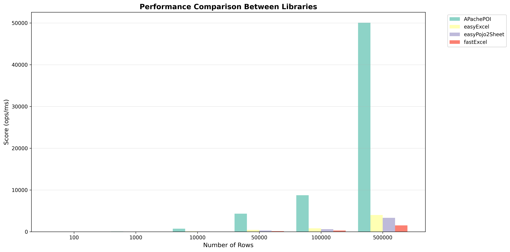
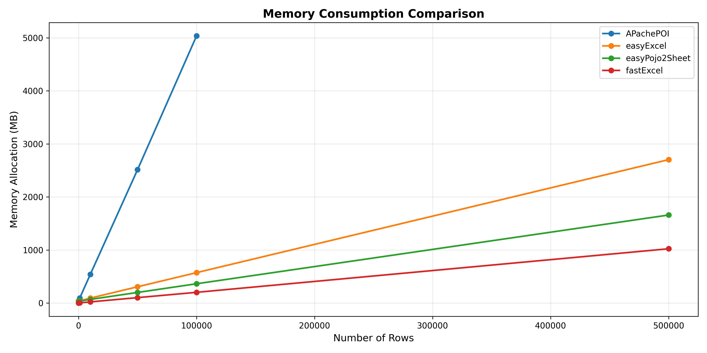

<div align="center">
  
  <br><br>
  <p><strong>Biblioteca Java simples e poderosa para exportar POJOs para Excel</strong></p>

[](https://central.sonatype.com/artifact/io.github.calazans/easypojo2sheet-core)
[](https://codecov.io/github/calazans/EasyPojo2Sheet)
[](https://openjdk.org/)
[](LICENSE.md)
[](https://github.com/calazans/EasyPojo2Sheet/stargazers)

---

### 🌐 Language / Idioma

**[🇧🇷 Português](#portuguese)** | **[🇺🇸 English](README_EN.md)**

</div>

---

<a name="portuguese"></a>

## 📖 Sobre o Projeto

**EasyPojo2Sheet** é uma biblioteca Java leve e eficiente para converter POJOs (Plain Old Java Objects) em planilhas Excel (.xlsx) de forma simples e elegante, utilizando anotações.

### ✨ Por que EasyPojo2Sheet?

- 🚀 **Simples e rápido** - Configure com anotações e exporte em segundos
- 📦 **Dependências mínimas** - Apenas Apache POI para manipulação de Excel
- 🎨 **Suporte a estilos** - Personalize cores, fontes e formatos
- ❄️ **Freeze Pane nativo** - Congele cabeçalhos automaticamente
- 📏 **Auto-size inteligente** - Ajuste automático de largura de colunas
- 🔧 **Framework-agnostic** - Funciona com Spring Boot, Quarkus, Micronaut, Jakarta EE e Java puro
- 🔗 **Propriedades aninhadas** - Acesse dados profundamente aninhados com notação de pontos
- 📊 **Agregações avançadas** - Sum, avg, min, max, count, join e distinct em listas
- 🎯 **Estratégias de renderização flexíveis** - Expanda listas em múltiplas linhas ou agregue dados

---
## ⚡ Performance e Benchmarks

Benchmarks JMH comparando EasyPojo2Sheet com Apache POI, EasyExcel e FastExcel revelam vantagens significativas:

- 💾 **Consumo de memória 67% menor que Apache POI** - apenas ~1.650 MB para processar 100.000 linhas
- 📊 **Throughput consistente** em diferentes volumes de dados (10k-500k linhas)
- 🔄 **Modo streaming integrado** garante uso de memória previsível mesmo com grandes datasets
- ⚖️ **Melhor equilíbrio** entre simplicidade de código, eficiência de recursos e performance adequada
- 🎯 **Ideal para casos de uso empresariais típicos** onde manutenibilidade é prioridade
- 🐳 **Perfeito para ambientes com memória limitada** como containers e serverless





> **Nota**: Embora não seja a biblioteca mais rápida em termos absolutos, o EasyPojo2Sheet prioriza produtividade do desenvolvedor e uso eficiente de recursos sobre micro-otimizações de performance.


## 📦 Instalação

### Maven
```xml
<dependency>
    <groupId>io.github.calazans</groupId>
    <artifactId>easypojo2sheet-core</artifactId>
    <version>1.0.1</version>
</dependency>
```

---

## 🚀 Guia Rápido

### 1. Anote sua classe

```java 
import br.com.easypojo2sheet.annotation.Spreadsheet; 
import br.com.easypojo2sheet.annotation.SheetColumn;
@Spreadsheet(name = "Relatório de Vendas", autoSizeColumns = true, freezeHeader = true) 
public class Venda {
    @SheetColumn(name = "ID", order = 1)
    private Long id;

    @SheetColumn(name = "Produto", order = 2)
    private String produto;

    @SheetColumn(name = "Quantidade", order = 3)
    private Integer quantidade;

    @SheetColumn(name = "Valor", order = 4, numberFormat = "R$ #,##0.00")
    private BigDecimal valor;

    @SheetColumn(name = "Data", order = 5, dateFormat = "dd/MM/yyyy")
    private LocalDate data;

    // Getters e Setters
}
```

### 2. Exporte para Excel

```java 
import br.com.easypojo2sheet.core.ExcelExporter;

import java.util.List;

public class ExemploExportacao {
    public void exportarVendas() throws Exception {
        // Seus dados
        List<Venda> vendas = List.of(
                new Venda(1L, "Notebook", 5, 3500.00, LocalDate.now()),
                new Venda(2L, "Mouse", 20, 45.90, LocalDate.now()),
                new Venda(3L, "Teclado", 10, 150.00, LocalDate.now())
        );

        // Exporte em uma linha
        // Exporte usando o builder pattern
        ExcelExporter.<Venda>builder()
                .data(vendas)
                .outputFile("relatorio-vendas.xlsx")
                .build()
                .export();

        System.out.println("Planilha gerada com sucesso!");
    }

}

```

### 3. Resultado

Uma planilha Excel será criada com:
- ✅ Cabeçalhos formatados e congelados
- ✅ Colunas ajustadas automaticamente
- ✅ Formatos de data e moeda aplicados
- ✅ Dados organizados e prontos para uso

---
## 🎯 Funcionalidades Avançadas

### 🔗 Propriedades Aninhadas

Acesse propriedades de objetos complexos usando notação de pontos:

```java
@Spreadsheet(name = "Relatório de Vendas") 
public class Venda{

    @SheetColumn(name = "Cliente", order = 1)
    private String nomeCliente;

    // Acessa propriedade do objeto vendedor
    @SheetColumn(name = "Vendedor", order = 2, property = "vendedor.nome")
    @SheetColumn(name = "CPF Vendedor", order = 3, property = "vendedor.cpf")
    private Funcionario vendedor;

// ... outros campos
}
public class Funcionario { 
    private String nome; 
    private String cpf; 
    // getters e setters 
 }
```
### 📊 Agregações em Listas

Realize agregações poderosas em coleções sem escrever código adicional:

```java
@Spreadsheet(name = "Relatório de Produtos") 
public class Pedido {
    @SheetColumn(name = "Número Pedido", order = 1)
    private Long numero;

    // Soma total de valores
    @SheetColumn(name = "Valor Total", order = 2,
            property = "itens.sum.valor",
            numberFormat = "R$ #,##0.00")

// Média de preços
    @SheetColumn(name = "Preço Médio", order = 3,
            property = "itens.avg.valor",
            numberFormat = "R$ #,##0.00")

// Valor mínimo
    @SheetColumn(name = "Menor Preço", order = 4,
            property = "itens.min.valor",
            numberFormat = "R$ #,##0.00")

// Valor máximo
    @SheetColumn(name = "Maior Preço", order = 5,
            property = "itens.max.valor",
            numberFormat = "R$ #,##0.00")

// Concatenação de nomes
    @SheetColumn(name = "Produtos", order = 6,
            property = "itens.join.nome",
            separator = "; ")

// Valores únicos concatenados
    @SheetColumn(name = "Categorias", order = 7,
            property = "itens.distinct_join.categoria",
            separator = ", ")

    private List<ItemPedido> itens;
}
public class ItemPedido {
    private Long numero;
    private String nome;
    private String categoria;
    private BigDecimal valor;
    // getters e setters 
}
```
#### 📋 Agregações Disponíveis

| Agregação       | Descrição                     | Exemplo                            |
|-----------------|-------------------------------|------------------------------------|
| `sum`           | Soma valores numéricos        | `produtos.sum.preco`               |
| `avg`           | Calcula média                 | `produtos.avg.preco`               |
| `min`           | Valor mínimo                  | `produtos.min.preco`               |
| `max`           | Valor máximo                  | `produtos.max.preco`               |
| `size`       | Tamanho da lista  | `produtos.size`                    |
| `join`          | Concatena valores             | `produtos.join.nome`               |
| `distinct_join` | Concatena valores únicos      | `produtos.distinct_join.categoria` |

### 🎨 Estratégias de Renderização de Listas

Controle como listas são renderizadas na planilha:
```java
@Spreadsheet(name = "Vendas Detalhadas") 
public class VendaDetalhada {
    @SheetColumn(name = "Código Venda", order = 1)
    private Long id;

    @SheetColumn(name = "Cliente", order = 2)
    private String cliente;

    // EXPAND_ROWS: Cria uma linha para cada produto    
    @SheetColumn(name = "Produto", order = 3,
            property = "nome",
            listStrategy = ListRenderStrategy.EXPAND_ROWS)

    @SheetColumn(name = "Preço", order = 4,
            property = "valor",
            numberFormat = "R$ #,##0.00",
            listStrategy = ListRenderStrategy.EXPAND_ROWS)

    private List<Produto> produtos;
}
```
**Resultado com EXPAND_ROWS:**

| Código Venda | Cliente | Produto |Preço|
|--------------|-----------|---------|---------|
| 1            | João |Notebook | R$ 3.500,00 |
|              |  |Mouse | R$ 45,90 |
|              |  |Teclado | R$ 150,00 |
| 2            | Maria |Monitor | R$ 800,00|

#### 📋 Estratégias Disponíveis

| Estratégia | Descrição | Uso |
|------------|-----------|-----|
| `AGGREGATE` | Usa agregações (sum, join, etc) | Padrão quando há `property` com agregação |
| `EXPAND_ROWS` | Cria uma linha por item | Ideal para detalhar listas |
| `EXPAND_ROWS_WITH_MERGED_ROWS` | Expande e mescla células não-lista | Visual mais limpo |
| `IGNORE` | Ignora a lista | Para listas não relevantes |

### 🔢 Acesso a Índices e Tokens Especiais

Acesse elementos específicos de listas:
```java
@Spreadsheet(name = "Análise") 
public class Analise {
    // Primeiro elemento
    @SheetColumn(name = "Primeiro Produto", order = 1, property = "produtos.first.nome")

    // Último elemento
    @SheetColumn(name = "Último Produto", order = 2, property = "produtos.last.nome")

    // Tamanho da lista
    @SheetColumn(name = "Total Produtos", order = 3, property = "produtos.size")

    // Índice específico
    @SheetColumn(name = "Segundo Produto", order = 4, property = "produtos[1].nome")
    private List<Produto> produtos;
}
```
### 🎭 Campos Calculados e Métodos

Exporte resultados de métodos como colunas:
```java
@Spreadsheet(name = "Performance") 
public class Desempenho {
    @SheetColumn(name = "Vendedor", order = 1)
    private String vendedor;

    @SheetColumn(name = "Meta", order = 2, numberFormat = "#,##0")
    private Integer meta;

    @SheetColumn(name = "Realizado", order = 3, numberFormat = "#,##0")
    private Integer realizado;

    // Método anotado é exportado como coluna
    @SheetColumn(name = "% Atingimento", order = 4, numberFormat = "0.00%")
    public Double getPercentualAtingimento() {
        return meta > 0 ? (double) realizado / meta : 0.0;
    }

    @SheetColumn(name = "Status", order = 5)
    public String getStatus() {
        double percentual = getPercentualAtingimento();
        if (percentual >= 1.0) return "Meta Atingida";
        if (percentual >= 0.8) return "Próximo da Meta";
        return "Abaixo da Meta";
    }
}

```

### ♻️ Múltiplas Colunas de um Mesmo Campo

Use `@SheetColumns` para criar múltiplas colunas a partir de um único campo:
```java
@Spreadsheet(name = "Relatório Completo") 
public class RelatorioCompleto {
    @SheetColumn(name = "Total Geral", order = 1,
            property = "itens.sum.valor",
            numberFormat = "R$ #,##0.00")
    @SheetColumn(name = "Preço Médio", order = 2,
            property = "itens.avg.valor",
            numberFormat = "R$ #,##0.00")
    @SheetColumn(name = "Qtd Itens", order = 3,
            property = "itens.size")
    private List<Item> itens;
}
```

### 🚫 Ignorar Campos

Use `@SheetIgnore` para excluir campos da exportação:
```java
@Spreadsheet(name = "Vendas") 
public class Venda {
    @SheetColumn(name = "ID", order = 1)
    private Long id;

    @SheetColumn(name = "Valor", order = 2, numberFormat = "R$ #,##0.00")
    private BigDecimal valor;

    // Campo ignorado na exportação
    @SheetIgnore
    private String observacoesInternas;

    @SheetIgnore
    private byte[] dadosSensiveis;
}
```

---

## 📚 Documentação Completa

### Anotações Disponíveis

#### `@Spreadsheet`
Define as configurações da planilha no nível da classe.

| Atributo | Tipo | Padrão | Descrição |
|----------|------|--------|-----------|
| `name` | String | Nome da classe | Nome da aba da planilha |
| `autoSizeColumns` | boolean | `false` | Ajusta largura automaticamente |
| `freezeHeader` | boolean | `false` | Congela a linha de cabeçalho |
| `startRow` | int | `0` | Linha inicial para os dados (0-based) |

#### `@SheetColumn`
Define as configurações de cada coluna.

| Atributo | Tipo | Padrão | Descrição |
|----------|------|--------|-----------|
| `name` | String | Nome do campo | Título da coluna |
| `order` | int | `Integer.MAX_VALUE` | Ordem de exibição |
| `property` | String | `""` | Caminho para propriedade aninhada |
| `dateFormat` | String | `""` | Formato de data (SimpleDateFormat) |
| `numberFormat` | String | `""` | Formato numérico (DecimalFormat) |
| `width` | int | `-1` | Largura fixa da coluna (-1 = auto) |
| `align` | HorizontalAlignment | `AUTO` | Alinhamento horizontal |
| `valign` | VerticalAlignment | `CENTER` | Alinhamento vertical |
| `separator` | String | `", "` | Separador para agregações JOIN |
| `listStrategy` | ListRenderStrategy | `AGGREGATE` | Estratégia de renderização de listas |

#### `@SheetColumns`
Container para múltiplas anotações `@SheetColumn` no mesmo campo.

#### `@SheetIgnore`
Marca um campo para ser ignorado na exportação.

### Enums de Configuração

#### `HorizontalAlignment`
- `LEFT` - Alinhamento à esquerda
- `CENTER` - Alinhamento centralizado
- `RIGHT` - Alinhamento à direita
- `AUTO` - Automático baseado no tipo de dado

#### `VerticalAlignment`
- `TOP` - Alinhamento superior
- `CENTER` - Alinhamento centralizado
- `BOTTOM` - Alinhamento inferior

#### `ListRenderStrategy`
- `AGGREGATE` - Usa agregações (padrão)
- `EXPAND_ROWS` - Expande em múltiplas linhas
- `EXPAND_ROWS_WITH_MERGED_ROWS` - Expande com células mescladas
- `IGNORE` - Ignora a lista

### Builder API

```java
ExcelExporter.builder() 
 .data(List) // Dados a serem exportados (obrigatório) 
 .outputFile(String) // Caminho do arquivo de saída 
 .outputStream(OutputStream) // Stream de saída alternativo 
 .rowAccessWindowSize(int) // Tamanho da janela de streaming (padrão: 100)
 .build() 
 .export();

```
---

## 🛡️ Tratamento de Erros

A biblioteca oferece exceções especializadas:
```java
    try { 
        ExcelExporter.builder() 
            .data(vendas)
            .outputFile("relatorio.xlsx")
            .build() 
            .export();
    }catch (ExcelExportException e) { // Erro durante exportação 
         log.error("Falha ao gerar Excel: {}", e.getMessage());
    }catch (PropertyExtractionException e) { // Erro ao acessar propriedades aninhadas 
         log.error("Propriedade inválida: {}", e.getMessage()); 
    }
```
### Exceções Disponíveis

- **`ExcelExportException`** - Erro geral de exportação
- **`PropertyExtractionException`** - Erro ao extrair propriedades aninhadas

---


##  Requisitos

- **Java**:  17 ou superior
- **Maven**: 3.6+ 

---

## ️ ️Compilando do Código Fonte

```bash
# Clone o repositório
git clone https://github.com/calazans/EasyPojo2Sheet.git
cd EasyPojo2Sheet

# Compile e instale localmente
mvn clean install

# Execute os testes
mvn test

# Gere o JavaDoc
mvn javadoc:javadoc
```

---
## 📊 Roadmap

- [ ] Suporte a múltiplas sheets em um único arquivo
- [ ] Estilos customizados via anotações
- [ ] Suporte a fórmulas Excel
- [ ] Validação de dados em células
- [ ] Export para CSV e outros formatos
- [ ] Importação de Excel para POJOs
- [ ] Suporte a internacionalização (i18n)

---

## 🤝 Contribuindo

Contribuições são bem-vindas! Sinta-se à vontade para:

1. Fazer um fork do projeto
2. Criar uma branch para sua feature (git checkout -b feature/nova-funcionalidade)
3. ✅ Commit suas mudanças (git commit -m 'Adiciona nova funcionalidade')
4. Push para a branch (git push origin feature/nova-funcionalidade)
5. Abrir um Pull Request

### Diretrizes

- Escreva testes para novas funcionalidades
- Mantenha a cobertura de testes acima de 80%
- Siga as convenções de código Java
- Documente APIs públicas com JavaDoc
- Use nomes descritivos para commits
- Execute todos os testes antes de submeter PR

---


## 🐛 Reportar Problemas

Encontrou um bug? [Abra uma issue](https://github.com/calazans/EasyPojo2Sheet/issues) incluindo:

- 📝 Descrição clara do problema
- 🔄 Passos para reproduzir
- ☕ Versão do Java e da biblioteca
- 💻 Código de exemplo (se possível)
- 📸 Screenshots (se relevante)

---

##  Licença

Este projeto está licenciado sob a [Apache License 2.0](LICENSE.md) - veja o arquivo LICENSE para detalhes.

---

## ‍ Autor

**Diogo Calazans**

- 🐙 GitHub: [@calazans](https://github.com/calazans)
- 📧 Email: calazans.contato.entering056@passinbox.com

---

## ⭐ Apoie o Projeto

Se este projeto foi útil para você:
- ⭐ Dê uma estrela no GitHub
- 🐛 Reporte bugs e sugira melhorias
- 🤝 Contribua com código
- 📢 Compartilhe com outros desenvolvedores


---

## 🙏 Agradecimentos

Agradecimentos especiais a todos os [contribuidores](https://github.com/calazans/EasyPojo2Sheet/graphs/contributors) que ajudaram a tornar este projeto melhor!

---

<div align="center">
  <sub>Feito com ❤️ por <a href="https://github.com/calazans">Diogo Calazans</a></sub>
</div>
```
